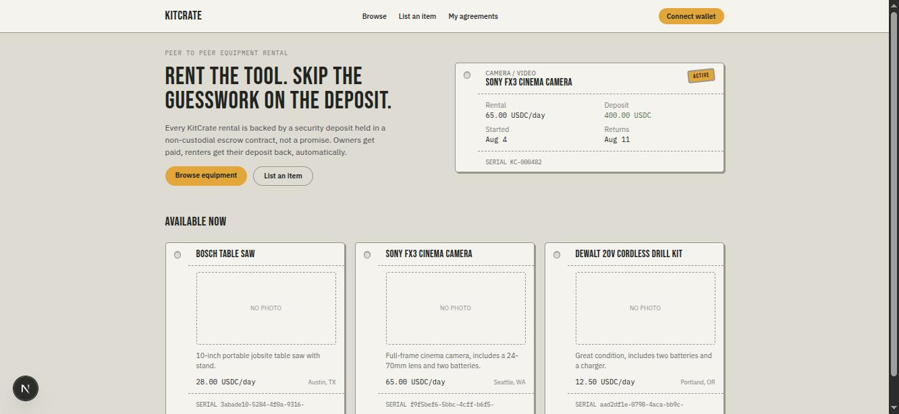
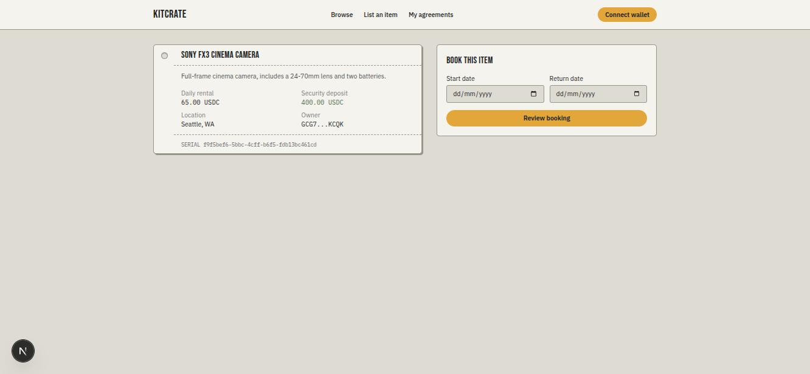
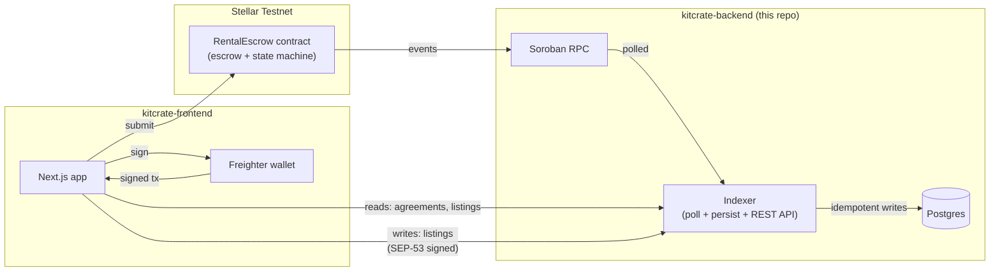

# KitCrate

**Peer-to-peer equipment rental, secured by a non-custodial Soroban escrow.**


[](https://github.com/KitCrate/kitcrate-backend/actions/workflows/ci.yml)


## What this is

KitCrate is a peer-to-peer marketplace for renting physical equipment: tools, cameras, construction gear, and event equipment. Renters and owners agree on a rental period and a security deposit. This repository holds the two pieces that make the deposit trustworthy without a platform holding the money: the `RentalEscrow` Soroban smart contract, which locks the rental fee and deposit on-chain and releases them by fixed rules instead of a company's discretion, and the indexer, a Node.js service that reads the contract's events, keeps a queryable copy of agreement and listing state in Postgres, and serves it over a REST API.

<p>
  
  
</p>

<sub>Screenshots from a local development run against the app's own code, seeded with throwaway test data — not the live deployment, which currently has no real listings (see Known limitations).</sub>

## Links

- **Docs:** [kitcrate.github.io/kitcrate-backend](https://kitcrate.github.io/kitcrate-backend/)
- **Frontend repo:** [github.com/KitCrate/kitcrate-frontend](https://github.com/KitCrate/kitcrate-frontend)
- **Live indexer API:** [kitcrate-indexer.onrender.com](https://kitcrate-indexer.onrender.com)
- **Deployed testnet contract:** `CABLLUB5PU6GR6OE66457W5L7SRSVSUEZ73OYV7W2P47A3L4ZVTZGIP5` ([view on stellar.expert](https://stellar.expert/explorer/testnet/contract/CABLLUB5PU6GR6OE66457W5L7SRSVSUEZ73OYV7W2P47A3L4ZVTZGIP5))

## Maintainer

GitHub: [@Hollujay](https://github.com/Hollujay)
Telegram: [@Hollujay21](https://t.me/Hollujay21)

## Architecture

Two pieces, connected only by on-chain events:

- **`contracts/rental-escrow`**: a `no_std` Rust crate built with `soroban-sdk 27.0.5`. Every state transition (create, fund, start, dispute, resolve, release, cancel, plus two permissionless timeout-based recovery paths — see below) emits an event. The contract never moves funds except through the escrow token's own `transfer` function.
- **`indexer/`**: a TypeScript service that polls the Soroban RPC for those events, persists them idempotently to Postgres, derives a current-state `agreements` table from them, and exposes it over a REST API. Listing metadata (title, photos, rate, deposit) lives here too, in a `listings` table with no on-chain equivalent; creating, editing, or deleting a listing requires a SEP-53 signed-message challenge proving control of the claimed owner address (see `indexer/src/auth/`) before the write is accepted. The frontend reads through this API rather than the chain directly.



Funds only ever move through the contract, directly between a renter/owner
wallet and the contract's own balance — the indexer and its Postgres
database are a read-side cache and a listings-metadata store, never
custodians of anything.

**Liveness:** a funded agreement whose owner never confirms handover, or a disputed agreement whose arbiter never rules, does not lock funds forever. Either case has a permissionless, time-gated recovery path (`reclaim_funded_agreement` after 7 days; `resolve_expired_dispute` after 14 days) that settles in the renter's favor rather than rewarding inaction — see [Protocol Mechanics](https://kitcrate.github.io/kitcrate-backend/protocol-mechanics.html) for the full state machine.

For the full agreement state machine, every function's auth and effect, and a worked numeric example, see [Protocol Mechanics](https://kitcrate.github.io/kitcrate-backend/protocol-mechanics.html) on the docs site. For every function signature and error code, see [Contract Reference](https://kitcrate.github.io/kitcrate-backend/contract-reference.html).

## Quick start

Prerequisites: Rust (rustc >= 1.91), the [Stellar CLI](https://developers.stellar.org/docs/tools/developer-tools#cli), Node.js >= 20, Docker.

**Build the contract:**

```sh
stellar contract build --package rental-escrow
```

Tested against this repo: produces `target/wasm32v1-none/release/rental_escrow.wasm` and reports 10 exported functions. `make wasm` runs the equivalent `cargo build` directly, if you'd rather not use the Stellar CLI. That count describes building this repo's current source, not necessarily the address linked above under Links — see the note at the top of [Contract Reference](https://kitcrate.github.io/kitcrate-backend/contract-reference.html) for whether the two currently match.

**Run the contract tests:**

```sh
cargo test
```

**Run the indexer locally:**

```sh
make db-up                 # starts local Postgres, indexer/docker-compose.yml
cd indexer
cp .env.example .env       # then set CONTRACT_ID to a deployed contract id
npm install
npm run dev
```

Real variables from `indexer/.env.example`: `RPC_URL`, `CONTRACT_ID`, `DATABASE_URL`, `PORT`, `POLL_INTERVAL_MS`, `START_LEDGER`.

**Indexer tests:** route-level integration tests against a real Postgres (no mocked database). Start the disposable test database, then run the suite:

```sh
make test-db-up            # starts a disposable Postgres, indexer/docker-compose.test.yml
cd indexer
npm test
```

`indexer/.env.test` (committed, non-secret) points `npm test` at that disposable database by default; it's never the same database `make db-up` starts for local dev.

## Contributing

See [CONTRIBUTING.md](./CONTRIBUTING.md): this project isn't currently accepting outside contributions.

## Known limitations

- **Zero live usage so far.** The deployed testnet contract has no on-chain agreements, and the live indexer's database is empty. The screenshots above are from a local development run with seeded test data, not the live deployment.
- **Render free-tier hosting.** The live indexer sleeps after a period of inactivity; the first request afterward can take up to about 50 seconds. The free Postgres database expires 30 days after creation and has to be recreated.
- **Multisig accounts need enough signature weight.** A Soroban invocation from an account requires total signer weight meeting that account's medium threshold. A single Freighter-connected key on a multisig account can fall short of it, in which case the network rejects an otherwise correctly built and signed transaction with `txBadAuth`. The frontend SDK detects this ahead of signing and surfaces a clear message on every write flow; the contract itself has no awareness of it; it's a property of how Stellar account auth works against any `require_auth()` call.
- **Listing-mutation challenges have no rate limit.** `POST /auth/challenge` is public and unauthenticated by design (possession of a challenge proves nothing without a valid signature over it), but the indexer doesn't currently throttle how many a single client can request. This bounds nothing about fund safety — challenges are single-use and never authorize a contract call — but an unbounded flood of them is an accepted, not-yet-addressed operational gap.
- **The `Funded`/`Disputed` recovery timeouts (7 and 14 days) are fixed, compiled-in constants**, not configurable per agreement. A future iteration could make them negotiable at `create_agreement` time if real usage shows the defaults are a poor fit for some listings; for now, changing them is a code change, deliberately not a runtime privilege.

## License

[MIT](./LICENSE).
