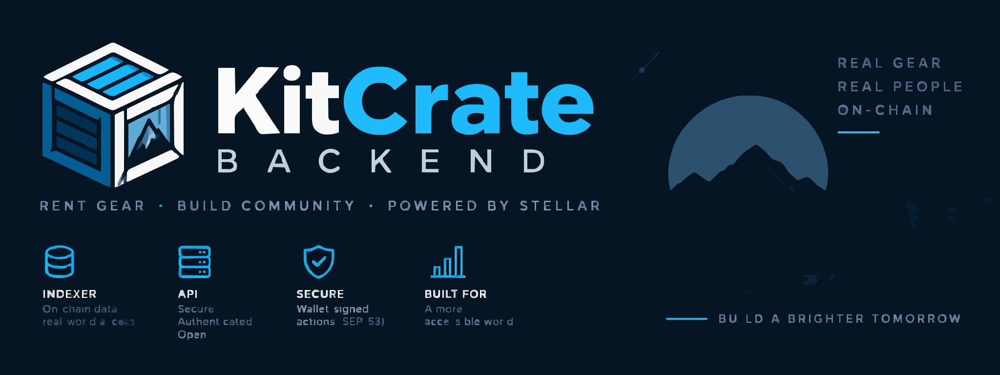
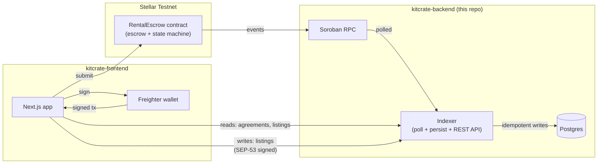
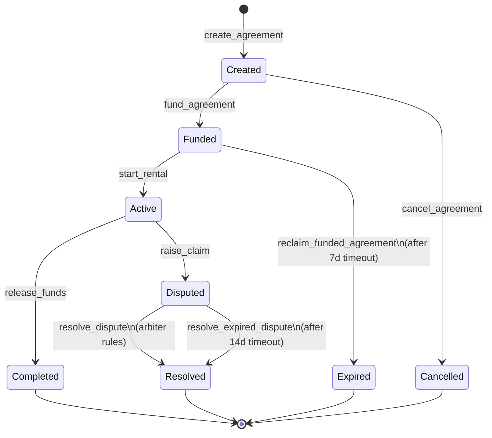

<p align="center">
  
</p>

# KitCrate Backend

**On-chain rental escrow contract and indexer/API for the KitCrate marketplace.**

[](https://github.com/KitCrate/kitcrate-backend/actions/workflows/ci.yml)


KitCrate is a peer-to-peer marketplace for renting physical equipment — tools, cameras, construction gear, event equipment. Renters and owners agree on a rental period and a security deposit without a platform custodying the money: a Soroban smart contract locks the rental fee and deposit and releases them by fixed, on-chain rules instead of a company's discretion. This repository holds that contract, `RentalEscrow`, and the indexer that turns its events into a queryable REST API for the [kitcrate-frontend](https://github.com/KitCrate/kitcrate-frontend) app.

Currently deployed to **Stellar Testnet** only — see [Testnet status](#testnet-status) below for exactly what's running.

## Project Links

| | |
| --- | --- |
| **Live indexer API** | [kitcrate-indexer.onrender.com](https://kitcrate-indexer.onrender.com) |
| **Documentation** | [kitcrate.github.io/kitcrate-backend](https://kitcrate.github.io/kitcrate-backend/) |
| **Frontend repo** | [github.com/KitCrate/kitcrate-frontend](https://github.com/KitCrate/kitcrate-frontend) |
| **Testnet contract** | [`CBV57X2CLKX2BHG2COGJNNOHU3ZY4A45L6SCZ32IZCKBS2LFEZ7CL4FR`](https://stellar.expert/explorer/testnet/contract/CBV57X2CLKX2BHG2COGJNNOHU3ZY4A45L6SCZ32IZCKBS2LFEZ7CL4FR) |

## What this repo does

- **`contracts/rental-escrow`** — a `no_std` Rust/Soroban contract that holds the rental fee and deposit for the life of an agreement and releases them by rule, not by a party's say-so. It never moves funds except through the escrow token's own `transfer`.
- **`indexer/`** — a Node.js/TypeScript service that polls Soroban RPC for the contract's events, persists them idempotently to Postgres, derives current agreement state from them, and serves it over a REST API. It also owns listing metadata (title, photos, rate, deposit), which has no on-chain equivalent; listing writes require a SEP-53 signed-message challenge proving control of the claimed owner address before they're accepted.

The frontend never talks to the chain or the database directly — contract writes go through a connected wallet, and all reads go through this indexer's API.

## Architecture



Funds only ever move through the contract, directly between a renter/owner wallet and the contract's own balance — the indexer and its Postgres database are a read-side cache and a listings-metadata store, never custodians of anything.

### Rental lifecycle



A funded agreement whose owner never confirms handover, or a disputed agreement whose arbiter never rules, does not lock funds forever: `reclaim_funded_agreement` (7-day timeout) and `resolve_expired_dispute` (14-day timeout) are permissionless recovery paths that settle in the renter's favor rather than rewarding inaction. For every function's exact auth and effect, and a worked numeric example, see [Protocol Mechanics](https://kitcrate.github.io/kitcrate-backend/protocol-mechanics.html).

## Contract

`contracts/rental-escrow`, built with `soroban-sdk 27.0.5`. Every state transition above emits an event, which is the indexer's only source of truth. For every function signature and error code, see [Contract Reference](https://kitcrate.github.io/kitcrate-backend/contract-reference.html).

## Indexer / API

`indexer/`, a TypeScript/Express service backed by Postgres. Read endpoints (`GET /listings`, `GET /agreements`, …) are public. Listing-mutation endpoints (`POST`/`PUT`/`DELETE /listings`) require a SEP-53 signed-message challenge proving control of the claimed owner address, obtained from `POST /auth/challenge` and consumed once. For the full endpoint-by-endpoint reference see [API Reference](https://kitcrate.github.io/kitcrate-backend/api-reference.html); for SDK-facing usage and a worked example, see the [Developer Guide](https://kitcrate.github.io/kitcrate-backend/developer-guide.html).

## Quick start

Prerequisites: Rust (rustc >= 1.91), the [Stellar CLI](https://developers.stellar.org/docs/tools/developer-tools#cli), Node.js >= 20, Docker.

**Build the contract:**

```sh
stellar contract build --package rental-escrow
```

Tested against this repo: produces `target/wasm32v1-none/release/rental_escrow.wasm` and reports 10 exported functions. `make wasm` runs the equivalent `cargo build` directly, if you'd rather not use the Stellar CLI. That count describes building this repo's current source — see [Testnet status](#testnet-status) for whether it matches the address linked above.

**Run the indexer locally:**

```sh
make db-up                 # starts local Postgres, indexer/docker-compose.yml
cd indexer
cp .env.example .env       # then set CONTRACT_ID to a deployed contract id
npm install
npm run dev
```

Real variables from `indexer/.env.example`: `RPC_URL`, `CONTRACT_ID`, `DATABASE_URL`, `PORT`, `POLL_INTERVAL_MS`, `START_LEDGER`.

## Development and testing

**Contract tests:**

```sh
cargo test
```

**Indexer tests:** route-level integration tests against a real Postgres (no mocked database). Start the disposable test database, then run the suite:

```sh
make test-db-up            # starts a disposable Postgres, indexer/docker-compose.test.yml
cd indexer
npm test
```

`indexer/.env.test` (committed, non-secret) points `npm test` at that disposable database by default — never the same database `make db-up` starts for local dev.

## Testnet status

**Repo and deployed contract now match.** `CBV57X2CLKX2BHG2COGJNNOHU3ZY4A45L6SCZ32IZCKBS2LFEZ7CL4FR` (linked above) was deployed and initialized from this repo's current `main`: wasm hash `98888df20ec96ccf073030d081a0eb8aed96fae80e68f3e9f634dad8f33c9a30`, independently re-verified against a fresh build of that exact source, exporting all 10 functions including both liveness-recovery paths (`reclaim_funded_agreement`, `resolve_expired_dispute`). This is a fresh deployment with **0 prior agreements**, confirmed directly from the contract's own `NextId` counter at initialization, not carried over from the previous address. The escrow token is unchanged: Testnet native XLM (`CDLZFC3SYJYDZT7K67VZ75HPJVIEUVNIXF47ZG2FB2RMQQVU2HHGCYSC`).

The live indexer's hardened build is separately confirmed live, independently, today: `POST /auth/challenge` now validates requests instead of returning `404`, and `GET /diagnostics/orphaned-events` responds instead of `404` — both routes that simply did not exist before the SEP-53 listing-auth rollout. The listener's event checkpoint is also confirmed correctly tracking this new contract: `sync_state` was previously an unscoped, single global checkpoint row (not per-contract), silently resuming from whatever contract was last watched regardless of `CONTRACT_ID`/`START_LEDGER`; fixed in indexer commit `87aed8b`. After applying that migration and redeploying, production logs showed `[listener] caught up through ledger 4670252` (this contract's actual deploy ledger), not the old, stale `4600000` value the bug had been stuck on — live, exercised confirmation the fix is active, not just deployed.

Contract-promotion work is tracked in [`docs/phase3-step1-contract-promotion-audit.md`](docs/phase3-step1-contract-promotion-audit.md), which remains a historical record of the pre-promotion state and is not updated to reflect this. Indexer-rollout work is tracked in a private, not-yet-published audit.

## Documentation

Full docs, including the state machine, contract reference, and guides for both roles, live at [kitcrate.github.io/kitcrate-backend](https://kitcrate.github.io/kitcrate-backend/):

- [Protocol Mechanics](https://kitcrate.github.io/kitcrate-backend/protocol-mechanics.html) — full state machine, every function's auth/effect, worked example
- [Contract Reference](https://kitcrate.github.io/kitcrate-backend/contract-reference.html) — every function signature and error code
- [API Reference](https://kitcrate.github.io/kitcrate-backend/api-reference.html) — every indexer REST endpoint, request/response shapes, and auth
- [Developer Guide](https://kitcrate.github.io/kitcrate-backend/developer-guide.html) — SDK API and integration examples
- [For Owners](https://kitcrate.github.io/kitcrate-backend/for-owners.html) / [For Renters](https://kitcrate.github.io/kitcrate-backend/for-renters.html) — role-specific walkthroughs

## Known limitations

- **Render free-tier hosting.** The live indexer sleeps after a period of inactivity; the first request afterward can take up to about 50 seconds. The free Postgres database expires 30 days after creation and has to be recreated.
- **Multisig accounts need enough signature weight.** A Soroban invocation from an account requires total signer weight meeting that account's medium threshold. A single Freighter-connected key on a multisig account can fall short of it, in which case the network rejects an otherwise correctly built and signed transaction with `txBadAuth`. The frontend SDK detects this ahead of signing and surfaces a clear message on every write flow; the contract itself has no awareness of it.
- **Listing-mutation challenges have no rate limit.** `POST /auth/challenge` is public and unauthenticated by design (possession of a challenge proves nothing without a valid signature over it), but the indexer doesn't currently throttle how many a single client can request. Challenges are single-use and never authorize a contract call directly, but an unbounded flood of them is an accepted, not-yet-addressed operational gap.
- **The `Funded`/`Disputed` recovery timeouts (7 and 14 days) are fixed, compiled-in constants**, not configurable per agreement.

## Contributing

See [CONTRIBUTING.md](./CONTRIBUTING.md): this project isn't currently accepting outside contributions.

## Maintainer

**Hollujay**
- GitHub: [@Hollujay](https://github.com/Hollujay)
- Telegram: [@Hollujay21](https://t.me/Hollujay21)

## License

[MIT](./LICENSE).
